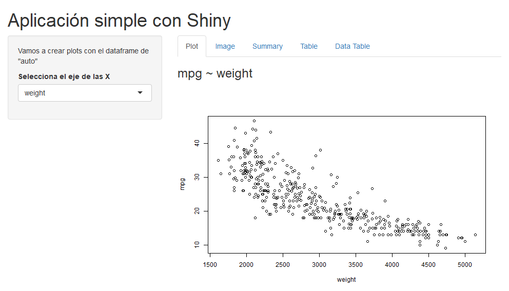

# Esto es una web app de Shiny

```{r echo=FALSE, warning=FALSE}
library(knitr)
library(webshot)
knitr::include_app('http://127.0.0.1:7967', height = 1000)

appshot(app = '../IntroShinyWebApp/', file = 'shiny.png',
        vheight = 400)

```

# Mostrar código de los chunks

```{r}
knitr::read_chunk('ui.R')
```

